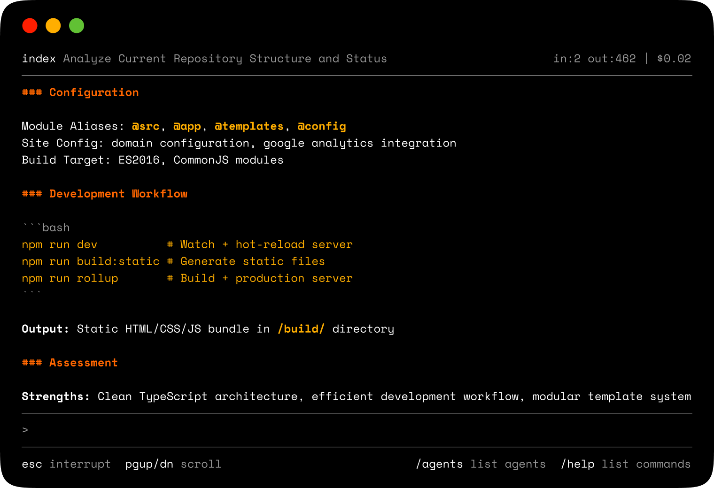

<p align="center">
  
</p>
<h1 align="center">Index</h1>

<p align="center">
  <strong>A lean agent orchestration runtime for the Claude API.</strong>
</p>

<p align="center">
  <a href="LICENSE"></a>
  
</p>



Index is a terminal-native multi-agent system built around **token efficiency**: match the model to the task, pair cheap executors with smarter advisors, and pay Haiku rates for Opus-grade reasoning. It runs a full-screen TUI with a persistent header, a command queue so you can type while agents are working, and a depth-limited delegation chain that lets the master agent dispatch tasks to specialists. Built on raw TLS — no libcurl, no HTTP framework.

### Why Index

- **Model per agent, not per project.** Each agent declares its own model. Route prose to Sonnet, triage to Haiku, architecture to Opus — never overpay for a task.
- **Advisor tooling.** A smaller executor (Haiku) drives the work while an advisor (Opus) weighs in mid-generation. Bulk token spend stays at the cheap-model rate; the expensive model only pays for the reasoning that actually needs it.
- **Brevity as a first-class setting.** `lite` / `full` / `ultra` modes shape output length at the constitution level, so agents don't burn tokens on filler.
- **Per-agent memory.** Persistent notes at `~/.index/memory/<agent>.md` keep context across sessions instead of rehydrating it into every prompt.
- **Visibility.** `/tokens` breaks down usage and cost by agent so you can see where the spend is going.

> **Note:** Index is an experimental project. Changes to the architecture may break the experience. Agent constitutions and orchestration methods are currently subject to change. Index's `/exec` commands are currently un-sandboxed. Use at your own risk.

## Install

### Homebrew (macOS)

```bash
brew tap tylerreckart/tap
brew install index
```

### Build from source

```bash
cmake -B build -DCMAKE_BUILD_TYPE=Release
cmake --build build
sudo cmake --install build
```

Requires: OpenSSL, C++20 compiler, libedit or GNU readline (optional but recommended).

### Setup

```bash
export ANTHROPIC_API_KEY="sk-ant-..."

# Initialize config directory, generate auth token, create example agents
index --init

# Launch interactive TUI
index
```

## Commands

### Conversation

| Command | Description |
|---------|-------------|
| `<text>` | Send to current agent |
| `/send <agent> <msg>` | Send to a specific agent |
| `/ask <query>` | Send directly to index(master) |
| `/use <agent>` | Switch current agent |

### Agents

| Command | Description |
|---------|-------------|
| `/agents` | List loaded agents |
| `/status` | System status and per-agent stats |
| `/tokens` | Full token usage breakdown with costs |
| `/create <id>` | Create agent with default config |
| `/remove <id>` | Remove agent |
| `/reset [id]` | Clear agent conversation history |
| `/model <agent> <model-id>` | Change agent model at runtime |

### Background Loops

Loops run an agent repeatedly in the background. The agent continues until it goes idle (two consecutive turns with no tool calls) or hits 20 iterations.

| Command | Description |
|---------|-------------|
| `/loop <agent> <prompt>` | Start agent in a background loop |
| `/loops` | List all running/suspended loops |
| `/log <id> [N]` | Show buffered output (last N entries) |
| `/watch <id>` | Tail loop output live (Enter to detach) |
| `/kill <id>` | Stop a loop |
| `/suspend <id>` | Pause a loop |
| `/resume <id>` | Resume a paused loop |
| `/inject <id> <msg>` | Send a message into a running loop |

### Tools

Agents issue these commands in their responses. The orchestrator executes them and feeds results back (up to 6 turns per message). You can also issue them directly as REPL commands.

| Command | Description |
|---------|-------------|
| `/fetch <url>` | Fetch a URL; HTML stripped to readable text |
| `/exec <shell command>` | Run a shell command; stdout+stderr returned |
| `/write <path>` | Write a file (content follows until `/endwrite`). Backs up existing files to `<path>.bak` before overwriting. |
| `/agent <id> <message>` | Invoke a sub-agent |
| `/mem write <text>` | Append note to agent's persistent memory |
| `/mem read` | Load agent memory into context |
| `/mem show` | Print raw memory file |
| `/mem clear` | Delete agent memory |

Memory is stored per-agent at `~/.index/memory/<agent-id>.md`.

## Agents

`index --init` creates five example agents in `~/.index/agents/`:

| Agent | Role | Notes |
|-------|------|-------|
| `index` | Orchestrator (built-in) | Routes tasks, delegates, synthesizes |
| `researcher` | Research analyst | Haiku executor + Opus advisor for cost efficiency |
| `reviewer` | Code reviewer | Ultra-brevity mode |
| `writer` | Content writer | Full prose mode, 8192 token cap, temp 0.7 |
| `devops` | Infrastructure engineer | Shell, git, Docker, CI/CD |
| `planner` | Task planner | Produces structured plan files with phase/dependency breakdown |

### Constitution format

Each agent is defined by a JSON file in `~/.index/agents/`:

```json
{
  "name": "reviewer",
  "role": "code-reviewer",
  "personality": "Senior engineer. Finds fault efficiently.",
  "brevity": "ultra",
  "max_tokens": 512,
  "temperature": 0.2,
  "model": "claude-sonnet-4-20250514",
  "goal": "Inspect code. Identify defects. Prescribe remedies.",
  "rules": [
    "Defects first, style second.",
    "Prescribe the concrete fix, never vague counsel."
  ]
}
```

### Brevity levels

| Level | Style |
|-------|-------|
| `lite` | Full grammar, no filler. Professional prose. |
| `full` | Drop articles, fragments permitted. Field-report style. |
| `ultra` | Maximum compression. Abbreviations, arrows, minimal words. |

### Agent modes

Set `"mode"` in the constitution to change the base system prompt:

| Mode | Description |
|------|-------------|
| _(unset)_ | Standard index voice — compressed, declarative |
| `"writer"` | Full prose mode — complete sentences, format guidance, no compression |
| `"planner"` | Decomposition mode — structured plan output, always writes to file |

### Advisor tool

Pair a cheap executor model with a smarter advisor for cost-efficient reasoning:

```json
{
  "model": "claude-haiku-4-5-20251001",
  "advisor_model": "claude-opus-4-6"
}
```

Opus plans mid-generation; Haiku executes. The bulk of token spend is at Haiku rates.

## Server mode

```bash
index --serve --port 9077
```

Accepts TCP connections. Clients authenticate with a SHA-256 hashed token generated by `index --init` or `index --gen-token`.

## One-shot mode

```bash
index --send reviewer "review: if (arr.length = 0) return;"
```

## License

CC BY-NC 4.0
